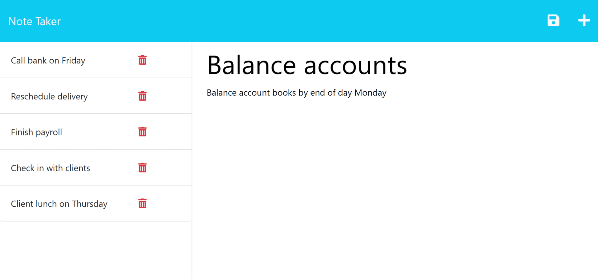

# Note-Taker

## Description


This project create an application called Note Taker that can be used to write and save notes. This application will use an Express.js back end and will save and retrieve note data from a JSON file.

 

## User Story

```
AS A small business owner
I WANT to be able to write and save notes
SO THAT I can organize my thoughts and keep track of tasks I need to complete
```


## Usage

To run this application launch the following URL in your browser: https://still-badlands-52979-a65e8ac8ed04.herokuapp.com/

## Source

My repo, is located at <https://github.com/mcgreevyjim66/Note-Taker>.
There is source code located in the Note-Taker folder.

## Mock-up





## Credits

Author: Jim McGreevy
Date:   9/18/2023


